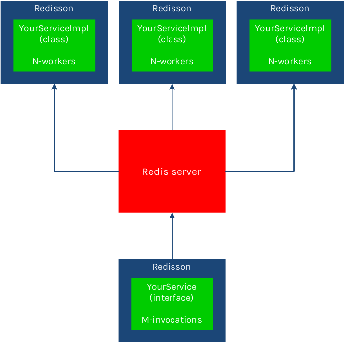
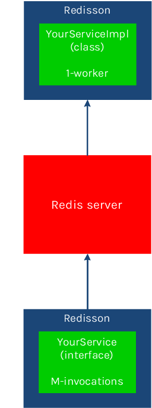

# 分布式对象

每个 Redisson 对象都绑定到一个 Redis 键(即对象名称)，且可以通过 `getName` 方法读取。

```java
RMap map = redisson.getMap("mymap");
map.getName(); // = mymap
```

所有和 Redis 键相关的操作被抽象到了 `RKeys` 接口：

```java
RKeys keys = redisson.getKeys();

Iterable<String> allKeys = keys.getKeys();
Iterable<String> foundedKeys = keys.getKeysByPattern('key*');
long numOfDeletedKeys = keys.delete("obj1", "obj2", "obj3");
long deletedKeysAmount = keys.deleteByPattern("test?");
String randomKey = keys.randomKey();
long keysAmount = keys.count();
```

## <a id="61-object"></a> Object

Redisson 分布式的 Java 对象 `RBucket` 可用作任意类型对象的通用容器。

```java
RBucket<AnyObject> bucket = redisson.getBucket("anyObject");
bucket.set(new AnyObject(1));
AnyObject obj = bucket.get();

bucket.trySet(new AnyObject(3));
bucket.compareAndSet(new AnyObject(4), new AnyObject(5));
bucket.getAndSet(new AnyObject(6));
```

## <a id="62-geospatial-holder"></a> 地理位置容器

Redisson 分布式的 Java 对象  `RGeo` 可用作地理位置项的容器。

```java
RGeo<String> geo = redisson.getGeo("test");
geo.add(new GeoEntry(13.361389, 38.115556, "Palermo"), 
        new GeoEntry(15.087269, 37.502669, "Catania"));
geo.addAsync(37.618423, 55.751244, "Moscow");

Double distance = geo.dist("Palermo", "Catania", GeoUnit.METERS);
geo.hashAsync("Palermo", "Catania");
Map<String, GeoPosition> positions = geo.pos("test2", "Palermo", "test3", "Catania", "test1");
List<String> cities = geo.radius(15, 37, 200, GeoUnit.KILOMETERS);
Map<String, GeoPosition> citiesWithPositions = geo.radiusWithPosition(15, 37, 200, GeoUnit.KILOMETERS);
```

## <a id="63-bitset"></a> BitSet

Redisson 分布式的 Java 对象  `RBitSet` 具有类似于 `java.util.BitSet` 的结构，
且表示的位向量会根据需要增长。BitSet 的大小由 Redis 限制为 `4 294 967 295`。

```java
RBitSet set = redisson.getBitSet("simpleBitset");
set.set(0, true);
set.set(1812, false);
set.clear(0);
set.addAsync("e");
set.xor("anotherBitset");
```

## <a id="64-atomiclong"></a> AtomicLong

Redisson 分布式的 Java 对象  `RAtomicLong` 具有类似于 
`java.util.concurrent.atomic.AtomicLong` 对象的结构。

```java
RAtomicLong atomicLong = redisson.getAtomicLong("myAtomicLong");
atomicLong.set(3);
atomicLong.incrementAndGet();
atomicLong.get();
```

## <a id="65-atomicdouble"></a> AtomicDouble

Redisson 分布式的 Java `AtomicDouble` 对象.

```java
RAtomicDouble atomicDouble = redisson.getAtomicDouble("myAtomicDouble");
atomicDouble.set(2.81);
atomicDouble.addAndGet(4.11);
atomicDouble.get();
```

## <a id="66-topic"></a> Topic

Redisson 分布式的 Java `Topic` 对象实现了 发布/订阅 机制。

```java
RTopic<SomeObject> topic = redisson.getTopic("anyTopic");
topic.addListener(new MessageListener<SomeObject>() {
    @Override
    public void onMessage(String channel, SomeObject message) {
        //...
    }
});

// in other thread or JVM
RTopic<SomeObject> topic = redisson.getTopic("anyTopic");
long clientsReceivedMessage = topic.publish(new SomeObject());
```

## <a id="661-topic-pattern"></a> Topic 模式

Redisson Java Topic pattern 对象可通过指定模式订阅到多个 topics。

```java
// subscribe to all topics by `topic1.*` pattern
RPatternTopic<Message> topic1 = redisson.getPatternTopic("topic1.*");
int listenerId = topic1.addListener(new PatternMessageListener<Message>() {
    @Override
    public void onMessage(String pattern, String channel, Message msg) {
         Assert.fail();
    }
});
```

Topic 模式监听器在重连到 Redis 服务器或者 Redis 服务器故障恢复时自动重新订阅。

## <a id="67-bloom-filter"></a> Bloom filter

Redisson 分布式的 Java Bloom filter 对象。

```java
RBloomFilter<SomeObject> bloomFilter = redisson.getBloomFilter("sample");
// initialize bloom filter with 
// expectedInsertions = 55000000
// falseProbability = 0.03
bloomFilter.tryInit(55000000L, 0.03);
bloomFilter.add(new SomeObject("field1Value", "field2Value"));
bloomFilter.add(new SomeObject("field5Value", "field8Value"));
bloomFilter.contains(new SomeObject("field1Value", "field8Value"));
```

## <a id="68-hyperloglog"></a> HyperLogLog

Redisson 分布式的 Java HyperLogLog 对象。

```java
RHyperLogLog<Integer> log = redisson.getHyperLogLog("log");
log.add(1);
log.add(2);
log.add(3);

log.count();
```

## <a id="69-remote-service"></a> 远程服务

基于 Redis 的分布式 Java 远程服务使得可以在不同的 Redisson 实例上执行远程接口上的对象方法。
或者说它可以执行 Java 远程调用。
使用 POJO 对象，方法参数和结果对象类型可以是任意的。

`RemoteService` 提供了两种类型的 `RRemoteService` 实例：

* **服务端实例** - 执行远程方法(工作者实例)，如：

```java
RRemoteService remoteService = redisson.getRemoteService();
SomeServiceImpl someServiceImpl = new SomeServiceImpl();

// register remote service before any remote invocation
// can handle only 1 invocation concurrently
remoteService.register(SomeServiceInterface.class, someServiceImpl);

// register remote service able to handle up to 12 invocations concurrently
remoteService.register(SomeServiceInterface.class, someServiceImpl, 12);
```

* **客户端实例** - 调用远程方法。如：

```java
RRemoteService remoteService = redisson.getRemoteService();
SomeServiceInterface service = remoteService.get(SomeServiceInterface.class);

String result = service.doSomeStuff(1L, "secondParam", new AnyParam());
```

客户端和服务端实例应使用相同的远程接口且后端是使用相同的服务器连接配置所创建的 Redisson 实例。
客户端和服务端实例可运行在相同的 JVM 上。
对客户端和/或服务端实例的数量没有限制。
(注：尽管 Redisson 没有强制任何限制，但 
[Redis 本事的限制还是存在的](http://redis.io/topics/faq#what-is-the-maximum-number-of-keys-a-single-redis-instance-can-hold-and-what-the-max-number-of-elements-in-a-hash-list-set-sorted-set)。 )

远程调用在 `1+` 个工作者存在时会以 **并行模式** 执行。



并行执行器总量可计算如下： 
`T` = `R` * `N`

`T` - 总可用并行执行器数量
`R` - Redisson 服务端实例数量
`N` - 在服务注册时所定义的执行器数量

超过这个数量的命令将放到队列中，在后续有可用执行器时再执行。

远程调用在 仅有 `1` 个工作者存在时将以 **顺序模式** 执行。
这时仅有一个命令会被同时执行，其它的命令都会被放到队列中。



### <a id="691-remote-service-message-flow"> 远程服务消息流

RemoteService 对每个调用创建了两个队列。
一个队列用于请求(由服务端实例监听)，而另一个用于应答响应和结构响应(由客户端实例监听)。
应答响应用于确定方法执行器是否有一个请求。
若在超时时间内没有得到应答，将抛出一个 `RemoteServiceAckTimeoutException`。

下图描绘了每个远程调用的消息流：


### <a id="#692-remote-service-fire-and-forget-and-ack-response-modes"></a> Remote service. Fire-and-forget and ack-response modes

RemoteService 可通过 `org.redisson.core.RemoteInvocationOptions` 对象来
为每次远程调用提供选项。
这些选项可用于改变超时时间和跳过应答响应和/或结果响应。如：

```java
// 1 second ack timeout and 30 seconds execution timeout
RemoteInvocationOptions options = RemoteInvocationOptions.defaults();

// no ack but 30 seconds execution timeout
RemoteInvocationOptions options = RemoteInvocationOptions.defaults().noAck();

// 1 second ack timeout then forget the result
RemoteInvocationOptions options = RemoteInvocationOptions.defaults().noResult();

// 1 minute ack timeout then forget about the result
RemoteInvocationOptions options = RemoteInvocationOptions.defaults().expectAckWithin(1, TimeUnit.MINUTES).noResult();

// no ack and forget about the result (fire and forget)
RemoteInvocationOptions options = RemoteInvocationOptions.defaults().noAck().noResult();

RRemoteService remoteService = redisson.getRemoteService();
YourService service = remoteService.get(YourService.class, options);
```

### <a id="693-remote-service-asynchronous-calls"> 远程服务异步调用

远程调用可以异步方式执行。
这时应该使用单独的以  `@RRemoteAsync` 注解标注的接口。
其方法签名需匹配远程接口中的相同的方法。
每个方法应返回 `io.netty.util.concurrent.Future` 对象。
异步接口验证将在 `RRemoteService.get` 方法调用期间被执行。
并不需要把所有方法都列出来，只需要列出需要以异步方式调用的方法。

```java
public interface RemoteInterface {

    Long someMethod1(Long param1, String param2);

    void someMethod2(MyObject param);

    MyObject someMethod3();

}

// async interface for RemoteInterface
@RRemoteAsync(RemoteInterface.class)
public interface RemoteInterfaceAsync {

    Future<Long> someMethod1(Long param1, String param2);

    Future<Void> someMethod2(MyObject param);

}

RRemoteService remoteService = redisson.getRemoteService();
RemoteInterfaceAsync asyncService = remoteService.get(RemoteInterfaceAsync.class);
```
