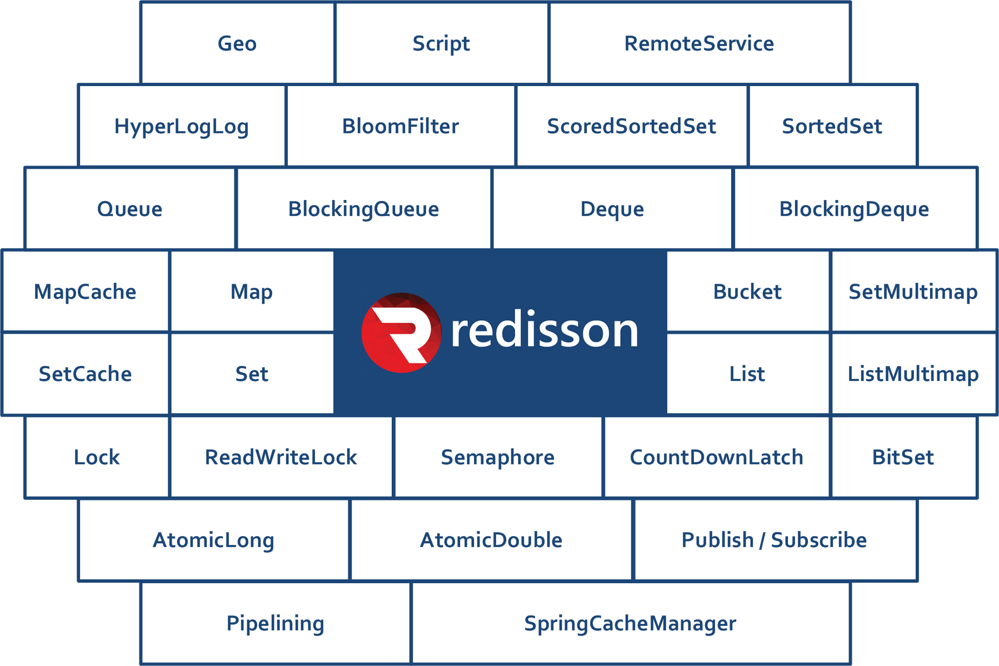

# 概览

Redisson 不只是一个 Java Redis 客户端，
它是一个以内存 Redis 服务器作为后端的处理 Java 对象
(如 `java.util.List`, `java.util.Map`, `java.util.Set`, `java.util.concurrent.locks.Lock` 等)
的一个框架。
它也提供了一些高级服务，如  
[RemoteService](./distributed_objects.md#69-remote-service) 和
[SpringCacheManager](./additional_features.md#94-spring-cache-integration)。
Redisson 的目标是提供使用 Redis 的更方便和容易的方式。
若你已经使用过其他 Java Redis 客户端，在迁移到 Redisson 过程中
[Redis命令映射](./cmd_mapping.md) 列表会很有用。

每个 Redis 服务器实例最多可处理 1TB 内存。

基于 [Netty](http://netty.io/) 框架。
[Redis](http://redis.io/) 2.8+ 和 JDK 1.6+ 兼容性。
